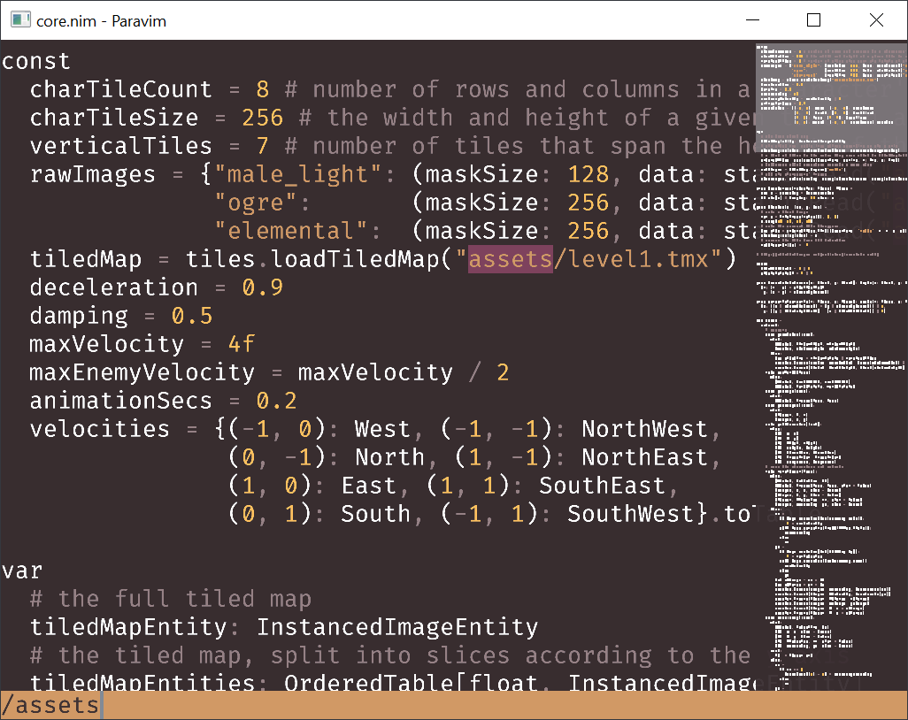

<p align="center">
  
</p>

Paravim is an editor for Nim powered by Vim (via [libvim](https://github.com/paranim/libvim)) and rendered with OpenGL (via [paranim](https://github.com/paranim/paranim)). There are two ways to run it:

1. **As a standalone executable.** That is what this repo contains. To build it, [install Nim](https://nim-lang.org/install.html) and do:

```
nimble install pvim
```

Then, as long as you have `~/.nimble/bin` on your PATH, you should be able to run `pvim` in any directory.

2. **Embedded inside a game.** The core of pvim is in a [separate library](https://github.com/paranim/paravim) that can be run inside a paranim game.

A few notes for linux users:

1. On Ubuntu, if pvim fails to build, you may need to install X11 and OpenGL related libraries with `sudo apt install xorg-dev libgl1-mesa-dev`
2. On Ubuntu, if pvim fails to load, try `sudo apt install libtinfo5`
3. On Arch, if pvim fails to load, you may need to do `sudo ln -s /usr/lib/libtinfo.so.6 /usr/lib/libtinfo.so.5`
